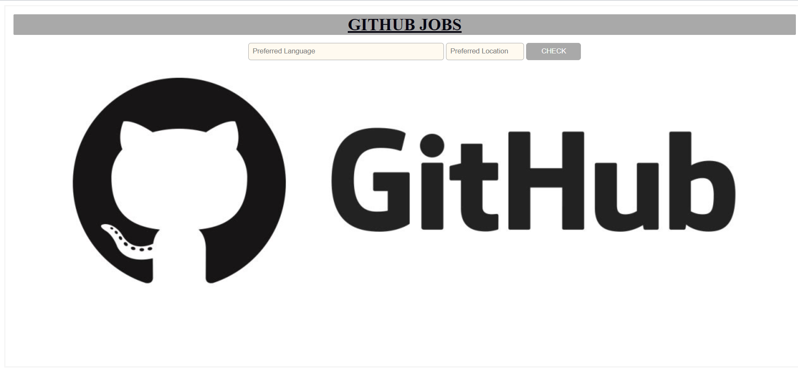

# masai-sprint-3

I designed and made the github job searcher.
It takes two inputs(preferred language for the job and location) from User.
It searches via url that adds those user inputs to the search API and fetches the response accordingly.
Used JavaScript to get data from the API and then appended elements after  getting required data.
The result shows the Job title, company name, location,Job description,type of job(full time or part time)
and the url to apply for it.
User can select the url of the desirable position and apply for it.
